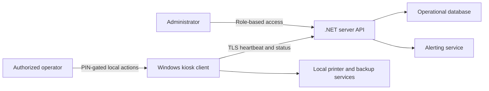

# Collain - Healthcare Backup Kiosk

An architecture case study for a Windows client/server system that helps healthcare operations teams monitor workstation backups from locked-down kiosk devices. This public edition documents the engineering approach without exposing proprietary source, deployment material, organization branding, screenshots, credentials, or operational data.

## Problem

Backup failures on distributed workstations can be easy to miss and expensive to diagnose. The system turns each Windows endpoint into a visible, centrally monitored participant: the kiosk shows local status, the server tracks heartbeats and backup freshness, and administrators receive actionable alerts when a device stops reporting or falls behind policy.

## System design

The design separates endpoint responsibilities from central policy and reporting. A Windows 11 kiosk client exposes only the operational controls needed on site, while a Windows Server service aggregates health, records audit events, and manages alerting.

## Engineering highlights

- WPF/.NET 8 client designed for Windows kiosk constraints
- Client heartbeat and stale-backup detection for fleet visibility
- PIN-gated local administration with time-bounded privileged access
- Printer status, test-page, and recovery workflows for on-site support
- TLS transport, encrypted configuration, role-based server access, and audit logging
- Operational alerting for missed syncs and outdated backups
- Deployment model targeting Windows 11 clients and Windows Server 2019+

## Reliability model

The client remains useful during temporary server outages by preserving local status and retrying synchronization. The server treats heartbeat freshness and backup age as separate signals, allowing operators to distinguish an unreachable endpoint from a reachable endpoint with a stale backup.

## Documentation

- [Architecture](docs/architecture.md)
- [Security and privacy](docs/security-and-privacy.md)
- [Operational behavior](docs/operations.md)
- [Public disclosure boundary](DISCLOSURE.md)

## Why source is omitted

The original project is designated for internal use and includes organization-specific deployment and security details. Publishing a source clone would create unnecessary confidentiality and operational risk. This repository is intentionally documentation-only and is suitable for discussing system design during an interview.

## Status

Sanitized portfolio case study. No hosted demo, binaries, production endpoints, or license grant are included.
