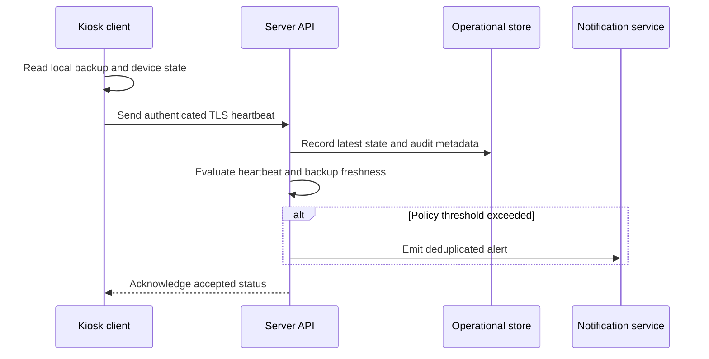

# Architecture

## Components

### Windows kiosk client

The .NET 8 WPF client presents backup and device status in a restricted Windows 11 session. Routine information remains visible without granting desktop access. Administrative actions such as configuration, printer testing, or exiting kiosk mode cross a PIN-gated boundary and are recorded as auditable events.

### Server application

The central Windows Server application receives device heartbeats, stores current and historical state, evaluates backup freshness, and presents fleet status to authorized administrators. Background checks convert missed heartbeats and stale backups into notifications without placing alerting logic on every endpoint.

### Shared contract

Client/server messages use a deliberately small status contract: endpoint identity, observation time, backup state, version, and health indicators. Keeping this boundary narrow reduces coupling and makes schema evolution easier to reason about.

## Data flow

## Design tradeoffs

- A native Windows client integrates cleanly with local printers, kiosk controls, and workstation services, at the cost of platform portability.
- Central alert evaluation creates one policy source of truth, but requires resilient heartbeat retries and clear offline semantics.
- PIN-gated local support reduces kiosk escape risk while retaining a recoverable path for authorized staff.
- Separating current status from audit history supports a fast dashboard without losing forensic context.
